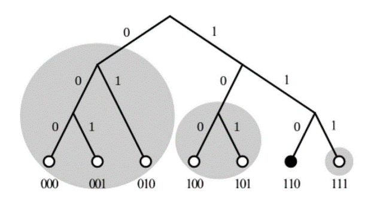
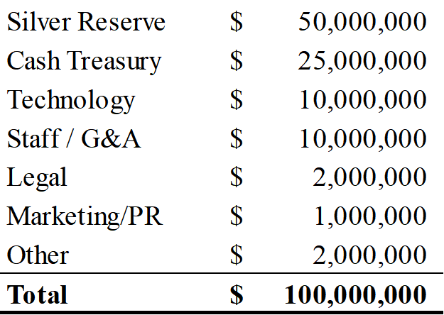

# Powering Open, Honest, Stable Markets

Sean Brehm, Nadab Akhtar, Eraj Akhtar, Wolf Kohn, and Daniel Guinan

CrowdPoint Technologies[^1]

July 4, 2022

# Abstract

> Technology is constantly evolving to meet the demands of a given
> period in history. Society has undergone three significant
> technological revolutionary periods: agrarian, industrial, and
> information. Today the next phase is unfurling as the intelligence
> revolution takes a foothold. Advances in artificial intelligence, big
> data, cloud computing, and blockchain are ushering in a new time for
> prosperity.
>
> CrowdPoint is at the forefront of the intelligence age and leads the
> Web3/blockchain competitive landscape with the advent of its crwd\_
> platform and Vogon decentralized cryptographic cloud technology. It
> has developed a unique methodology to correct the data-sharing problem
> by fixing the foundations of internet technology, building
> fintech-enabled delivery channels for the market, and empowering the
> average user with powerful new tokenized asset classes.

# Contents

[Abstract 1](#abstract)

[Introduction 4](#introduction)

[Problem 4](#problem)

[Solution 5](#solution)

[Blockchain Technologies 6](#blockchain-technologies)

[FinTech & Blockchain 6](#fintech-blockchain)

[Liquidity & Blockchain 7](#liquidity-blockchain)

[Private Markets and the Evolution of a DAO
8](#private-markets-and-the-evolution-of-a-dao)

[Benefits Realized by Investors from Regulated Digital Securities
8](#benefits-realized-by-investors-from-regulated-digital-securities)

[CrowdPoint's Blockchain-enabled Solutions for Investors
9](#crowdpoints-blockchain-enabled-solutions-for-investors)

[Secondary Markets: Liquidity Created via Blockchain-enabled
Computational Trust
9](#secondary-markets-liquidity-created-via-blockchain-enabled-computational-trust)

[Blockchain Buttonwood Agreement 10](#blockchain-buttonwood-agreement)

[Market Differentiator 11](#market-differentiator)

[Organizing Markets 11](#organizing-markets)

[Technology Differentiator 11](#technology-differentiator)

[Overview 11](#overview)

[Introducing Vogon 12](#introducing-vogon)

[Blockchain Challenges 12](#blockchain-challenges)

[Speed, Scalability, Security, Sharding, Microservices, and More
13](#speed-scalability-security-sharding-microservices-and-more)

[Mind-boggling Fast Speeds 13](#mind-boggling-fast-speeds)

[Vogon Power Requirements 13](#vogon-power-requirements)

[Vogon Security 13](#vogon-security)

[A Safer, Better Internet 14](#a-safer-better-internet)

[Towels: Vogon Microservices, Creating a Decentralized Cloud
14](#_Toc107951364)

[Development Example 14](#development-example)

[Vogon Consensus: Block Graph at Scale
14](#vogon-consensus-block-graph-at-scale)

[Searching on Vogon 16](#searching-on-vogon)

[Vogon: Defending the Human Identity
16](#vogon-defending-the-human-identity)

[Vogon Design and Engineering 17](#vogon-design-and-engineering)

[Vogon and Digital Transformation
17](#vogon-and-digital-transformation)

[Additional Selected Intellectual Property developed by CrowdPoint
17](#additional-selected-intellectual-property-developed-by-crowdpoint)

[Tokenomics 18](#tokenomics)

[Context 18](#context)

[Introducing crwdunits 18](#introducing-crwdunits)

[Adding Reality to the Ecosystem 19](#adding-reality-to-the-ecosystem)

[crwdunits Utility and Features 19](#crwdunits-utility-and-features)

[Summary: Open, Honest, Stable Markets
20](#summary-open-honest-stable-markets)

[Illustrative Use Case 20](#illustrative-use-case)

[crwdunit Value Propositions 21](#crwdunit-value-propositions)

[Value-added Benefit to Crypto Exchanges
21](#value-added-benefit-to-crypto-exchanges)

[CrowdPoint Roadmap 22](#crowdpoint-roadmap)

[Allocations 23](#allocations)

[Allocation of Funds 23](#allocation-of-funds)

[Allocation of Tokens 23](#allocation-of-tokens)

[Leadership Team 24](#leadership-team)

*In 1889, Friedrich von Wieser asserted in his book "Natural Value" that
utility is the highest principle of all economies. "The utility is
imperfectly contained in value. The amount of utility contained is
intimately associated with the idea of goods. Where value and utility
come into conflict, utility must conquer; nothing in the nature of value
could give it the ascendency."*[^2]

# Introduction

CrowdPoint is pioneering the evolution of free markets by developing an
ecosystem on the blockchain.

Blockchain ecosystems are networks of participants in a blockchain that
share business objectives and processes. In today's market, the business
ecosystems operated by large technology companies extract value
exclusively for themselves. CrowdPoint is a blockchain ecosystem that
ensures that all participants can extract value from its use.

The user is at the heart of the blockchain ecosystem. An individual's
data constitutes a digital image of themselves and is the requisite
foundation for measuring online e-commerce activities. In the blockchain
ecosystem, a user claims a decentralized identity (DID), a new type of
identifier with both bullion and numismatic value based on the user's
data's volume, velocity, variety, and veracity. The DID allows users to
secure their privacy, protect their identity from exploitation, and
improve their financial performance.

## Problem

The information age made it easier for people to connect with friends
and things they care about through the internet. The dot-com era spawned
entire new industries overnight and created troves of new data from how
people consumed products and interacted with each other. In this mad
dash, the average person suffered as consumerism and corporate greed
took over. What was supposedly a free market became monopolized by a few
giant corporations that crushed innovation and promoted surveillance
capitalism.

***Society has a data-sharing problem.*** Human history has never been
so interconnected with overwhelming amounts of data to inform decisions
at every turning point.

-   People need a better way to organize and connect

-   Top-down control is no longer an effective solution

-   Society is forming market networks to meet challenges

The average person needs equal access to intelligence. However, to
garner this, the question must first be answered: what is intelligence?

*Exhibit 1*

**DATA** (statistics on a subject) **+ VALUE** (measure of economic
activity)

**= INFORMATION** (representation of even sequence)

**INFORMATION x DISTRIBUTION** (network to share information)

**= INTELLIGENCE** (derived beneficial knowledge)

*Source: CrowdPoint Technologies.*

From the preceding, it is clear that everything possesses intrinsic
value. By encapsulating data and value into one transaction and sharing
real-time intelligence, CrowdPoint aims to lower the friction of
economic alignment of interest across communities of interest.

## Solution

Unlike other technology platforms operating today, CrowdPoint helps
users who want to unlock value by fixing how people share data, building
a better market, and empowering the community.

To meet the stated goals, CrowdPoint developed the crwd\_™ product
family as the consumer-facing vehicle on top of its proprietary,
next-generation decentralized cryptographic cloud platform ---
Vogon™.[^3],[^4] This platform allows for better intelligence
sharing, a delivery channel for Vogon-powered services, and incentive
mechanisms to drive user growth.

*Exhibit 2*

**The crwd\_** **Product Family**

-   crwd**id** -- Returning value to users

-   crwd**market** -- Buy and sell everywhere

-   crwd**capital** -- Spend smarter, live better

-   crwd**finance** -- Build your future

-   crwd**world** -- Create your world

-   crwd**systems** -- Powering the digital realm

*Source: CrowdPoint Technologies.*

*Introducing the World's First Decentralized Cryptographic Cloud
Platform*

Vogon is a fully integrated, end-to-end solution for the market
purpose-built to fix how people, technology, and data interconnect. This
new architecture has boundless scale, fault-tolerance, and
enterprise-grade database speeds to power truly secure computing.

-   Microservices architecture allows the installation of apps directly
    onto a block like a container

-   Deterministic concurrency runs three blocks at the same time for
    blazing-fast speeds

-   Group mitosis splits transactions and speeds up the system to
    achieve an infinite scale

-   GraalVM multi-language support opens the platform to a massive 35.9
    million developers

-   BLS 12-381 cryptography and chain key signatures provide a secure,
    trustful environment

-   Relational tables inside blocks permit API calls and eliminate the
    need for middleware

*Fintech Marketplaces Bring Consumers Closer to the Transaction to
Improve User Experience*

Using CrowdPoint, marketplaces can eliminate intermediaries and
integrate fintech directly into their platforms for a more user-friendly
experience.

-   Inclusive payments capture demand by reducing friction

-   Access to capital unlocks latent supply in the market

-   Real-time intelligence expands the buyer-seller relationship

-   Integrated systems subsidize product/market by bundling

-   Regulated, open markets eliminate misaligned incentives

*Tokenizing Markets Aligns Incentives and Drives Participation*

CrowdPoint's platform constantly reduces risk, optimizes performance,
and predicts market dynamics from cross-sector activity by tokenizing
transactions. Tokenized markets permit the measure of individual
activity against a benchmark to ensure performance and lift in group
segments or industry coalitions across economic sectors.

# Blockchain Technologies

## FinTech & Blockchain

Financial technology is one of the stand-out applications of blockchain
technology and is especially suitable for the complexities of the
banking and securities industries. Numerous upstream, midstream, and
downstream proponents are involved in these two industries. The
intricacy of the financial services industry has historically created
substantial administrative due diligence and regulation laden with high
transactional costs. Financial institutions can simultaneously reduce
errors and costs by using blockchain technology to manage backend
functions.

-   Reduced Risk of Fraud & Disputes: Blockchain technology will enhance
    transparency, security, and efficiency in commercial and capital
    markets. Through sharing digital information on the blockchain,
    companies in a cooperative ecosystem could virtually eliminate the
    cost of intercompany reconciliations and third-party data hubs.
    Disputes between parties could reference the unified data on the
    blockchain to arbitrate any disagreement. Merchants can
    significantly reduce disputed transactions by utilizing
    crwd**units** and smart contracts as a settlement tool on an
    immutable blockchain ledger.

-   Transaction Simplification and Speed: Cryptocurrencies have the
    advantage of near-instantaneous transaction speed and low
    transaction cost. Companies operating in commercial (e.g.,
    e-commerce sites) or capital markets (e.g., securities, bonds, et
    al.) have a large volume of transactions. Utilizing blockchain
    payments could significantly reduce transaction costs. One element
    of this new technology that can bind skeptics and true believers is
    the potential of blockchain to simplify processes that can lead to
    enhanced efficiency and cost reductions. Vogon can instantly offer
    transactional verification across a network without relying on a
    central authority---potentially reducing operating costs, more
    securely storing and managing data, and improving transaction
    processing speed.

-   Contracts and Agreements: Various real-world scenarios can be coded
    in advance to any agreed-upon criteria utilizing blockchain and
    smart contracts, with the ability to self-execute should all the
    conditions be met. Such criteria could include triggers such as
    government approval, completion of payment, or title transfers.
    Joint ventures could even utilize smart contracts to fulfill audit
    clauses and codify any sharing costs or revenues issues. By creating
    a single audit trail, joint ventures can drastically reduce their
    reporting burden to tax authorities and costs associated with legal
    disputes.

The potential use cases of blockchain technology are becoming more
apparent as the technology becomes more prevalent throughout all
industries. Those in the financial technology industry face the same
question as leaders in many other industries. The disruptive potential
of blockchain technology is high, but blockchain technology requires
collaboration between companies in a vertical, supply chain, or industry
niche (i.e., ecosystem). Companies must form working groups and explore
potential solutions with their existing business partners.

The founder of Ethereum, Vitalik Buterin, underscored the utility of
blockchain technology to ecosystems:

*"Whereas most technologies tend to automate workers on the periphery
doing menial tasks, blockchains automate away the center. Instead of
putting the taxi driver out of a job, blockchain puts Uber out of a job
and lets the taxi drivers work with the customer directly."*

Blockchain is a technology that can transform networks; this innovative
tool can deliver efficiency, transparency, and liquidity to the
companies and stakeholders it connects. Recently, some of the most
successful companies have been networks such as Airbnb, Amazon, Google,
Meta, and Uber. These companies provide a value proposition by
centralizing and organizing market participants; they generate revenue
by taking a high percentage of the transactions they facilitate.

As Vitalik described above, blockchain ecosystems flip this
centralization model. In ecosystems, monetization is achieved through
ownership of the network by its users. The networks of the current
internet have a centralized model where the principal entity providing
services earns fees.

Indeed, numerous blockchain communities have formed since the first
successful blockchain network, Bitcoin, and the subsequent success of
Ethereum. These communities were scaled with a decentralized model in
mind and became decentralized autonomous organizations (DAOs). DAOs may
seem new to traditional markets, but they are, in fact, a combination of
gig economies and both private and public capital markets.

## Liquidity & Blockchain

*"One of the ironies of the stock market is the emphasis on activity.
Brokers, using terms such as 'marketability' and 'liquidity,' sing the
praises of companies with high share turnover...but investors should
understand that* *what is good for the croupier is not good for the
customer. A hyperactive stock market is the pickpocket of enterprise."*
-- Warren Buffet

In the past, successful companies aimed to go public, as doing so would
garner monetization events for shareholders, capital for growth, and
prestige for the brand.

As illustrated in *Exhibit 3*, the number of public companies in the
United States has declined over the past 20 years. Fewer companies are
going public due mainly to the myriad of challenges of being a public
company. These challenges include market pressures (e.g., short-term
thinking by investors impacts share price, stronger correlation to
geopolitical events vs. private companies, et al.), regulatory
constraints, diversified ownership, reporting costs, and more.

McKinsey & Company states, "the number of public-company listings in the
United States peaked in the mid-1990s, at nearly 6,000, but that number
has fallen by about half over the past 20 years. The number of initial
public offerings (IPOs) has also decreased sharply in this period.
McKinsey's examination of close to 10,000 public-company listings and
IPOs in the United States over the past two decades reveals that the
drop-off in the number of listed public companies is primarily the
result of changing dynamics in several key sectors: banking,
industrials, and technology."[^5]

*Exhibit 3*

*Source: S&P Global; Corporate Performance Analytics by McKinsey.*

Now companies stay private longer than in the past, while pensions and
mega-funds infuse a record amount of capital in public markets. This
convergence of capital and public markets portends an opportunity for
private companies that utilize blockchain technology to transform
themselves digitally. Such companies can garner significant operational
benefits and access open, honest, stable markets enabled by blockchain
technology.

Concerning the preceding, crypto companies --- whether through security
tokens or coins --- have already blurred the lines between public and
private markets. Crypto companies are liquid companies with virtually no
barriers to participation for unaccredited investors.

## Private Markets and the Evolution of a DAO

The original use of the Decentralized Autonomous Organization (DAO) on
other blockchains allowed investors to send money from anywhere in the
world anonymously[^6]. As part of this process, the DAO would provide
those owners tokens and voting rights; the projects varied and were not
an efficient use of securitizing assets.

Current DAO models offer liquidity through offerings such as staking
(i.e., pledging assets to collateralize a DAO), bonding (the DAO sells
discounted tokens to holders who receive fees over the bond period), and
selling (exiting the DAO). The most common approach to DAO liquidity is
staking.

CrowdPoint's approach to DAOs is organizing private company activity in
sub-industries according to the Global Industry Classification Standard
(GICS®)[^7] (more detail to follow in this paper). By classifying
economic activity and tracking it with crwd**units** and other digital
assets, "DAOs" within CrowdPoint can effectively become next-generation
exchange-traded funds (ETF) or exchange-traded notes (ETN).
crwd**units** collateralize these next-generation DAOs in crwd**world**.
This method would securitize the underlying industry focus by staking
and bonding the value of crwd**units** based on silver. Now the "DAO"
becomes a new kind of index that tracks the underlying sub-industry.

## Benefits Realized by Investors from Regulated Digital Securities

Many investors, including institutional and retail, have unprecedented
cash-on-hand levels but are limited in deploying such funds. In the
current climate, investors lose if they: 1) hold onto cash (inflationary
risk), 2) invest it in public markets (recession risks), or 3) invest in
cryptocurrency (volatility risk, as exacerbated by the collapse of Terra
and Luna). Where can investors pragmatically expect to find any yield? A
logical answer is to invest in private companies focused on innovation,
specifically digital assets issued by private companies and traded on
blockchain-enabled exchanges with liquidity.

Large institutional investors (e.g., pension funds) will soon have no
choice but to embrace new asset classes as debt float shrinks along with
developed-market demographics. If such funds start seeing declining
levels of inflation-adjusted yield, these conditions will inevitably
force investors to seek other allocations for their capital.

Similarly, more family offices are considering investments in digital
assets. According to a recent Goldman Sachs survey of 150 family
offices, "some family offices are considering cryptocurrencies to
position for higher inflation, prolonged low rates, and other
macroeconomic developments following a year of unprecedented global
monetary and fiscal stimulus... Of the approximately two-thirds of
family offices actively thinking about an increase in inflation, digital
assets emerged as one portfolio solution." The survey results indicate
that 42% of respondents are investing in digital assets, and 37% are
investing in precious metals (see the chart below).[^8]

*Exhibit 4*

*Source: Goldman Sachs.*

## CrowdPoint's Blockchain-enabled Solutions for Investors

Indeed, investors can draw the logical conclusion that digital assets'
potential yield looks attractive compared to traditional investment
vehicles. In the case of pension funds, yield is necessary for the funds
to offset their future liabilities. Shrinking yield in public securities
and fully funded status will allow these funds to stomach greater risk.
Further, family office interest in digital assets will likely increase
as secure platforms emerge and regulations become more explicit to
traditional financial counterparts.

CrowdPoint believes that evangelizing the utilization of registered
digital assets backed by transactions and precious metals will deliver
pension funds, family offices, broker-dealers, and registered investment
advisors, among other investor types, avenues for realizing yield. These
registered digital assets are possible because of innovative
technologies such as blockchain.

The blockchain value proposition offered by CrowdPoint provides
investors with unprecedented secondary markets. Investors can gain
previously unrealized value by bringing private companies into a
blockchain ecosystem (including their securities and commerce). Further,
these private companies will access additional distribution channels to
reach new customers and investors. CrowdPoint's technology offering
allows small and medium-sized private companies to utilize its platform
to increase operational and financial efficiencies and compete on the
same playing field as larger publicly-traded enterprises.

Recent examples of blockchain changing how transactions happen include
the syndication of bonds with the European Investment Bank's first 100
million Euro digital bond issued on a public blockchain. However, a more
significant opportunity for using Vogon technology is private debt. It
will not be long that trade finance, direct lending, and peer-to-peer
lending move into distressed assets, litigation financing, asset
transfers, and specialty finance.

## Secondary Markets: Liquidity Created via Blockchain-enabled Computational Trust

-   Blockchain technology minimizes or eliminates third parties in
    transactions. In the case of securities transactions, the
    disintermediation as mentioned above refines markets by speeding-up
    equity monetization events and removing non-essential parties

-   Private markets present a challenge in terms of liquidity. Investors
    in private companies must wait for a monetization event or another
    exit strategy (e.g., company buy-back or OTC trade)

-   Institutional investors in private markets (e.g., private equity
    firms, venture capital firms, family offices, or others) stand to
    benefit significantly from blockchain-enabled secondary markets

-   Limited partners or other investors in institutional funds would
    likely be more willing to invest in a fund if they know there is an
    avenue for them to withdraw their investment

-   Limited partners or other investors in institutional funds would be
    able to trade digital assets/securities with other investors
    connected to the transfer agent or ATS

-   Institutional investors such as private equity firms or venture
    capital firms could fundamentally alter their investment strategies,
    related timelines and costs, and IRR performance metrics due to
    blockchain technology's ability to optimize the transaction process
    for shareholders

-   Platforms trading private securities would garner the benefit of
    revenue from trading volume and related fees

# Blockchain Buttonwood Agreement

The Buttonwood Agreement of May 17, 1792, established the basis of the
modern New York Stock Exchange. The brokers who wrote this agreement and
signed it created trust in the system by agreeing to the following key
terms: 1) brokers would only deal with each other, eliminating
auctioneers and speculators, and 2) standardize commissions at 0.25% of
specie value.

In establishing a uniform, closed, members-only financial exchange
trading desk, the marketplace in the United States began to switch from
Philadelphia to New York City. The shared trust between investors and
brokers, investors, and businesses grew as investors knew valuations and
other metrics were accurate, and the traded currency was valid. In 1817
the number of brokers had grown, and they named their trading desk the
New York Stock Exchange Board.

In the 1800s, a "curb exchange" began on Broad Street to exchange stocks
for those companies that did not meet the requirements for the NYSE
floor. The curb exchange grew into the American Stock Exchange when in
1921, it moved into actual "quarters" on Trinity. In 2008 the NYSE
acquired the AMEX and Euronext exchanges. Today, the stocks traded on
the AMEX are small-cap stocks.

In keeping with the Buttonwood Agreement, traders in Chicago organized a
commodities exchange in 1848 to market agricultural products (corn,
soybeans, grains). They then expanded to include options and futures on
several other products (meat, gold, silver, U.S. Treasury Bonds).

The war engine had driven the world's economic growth from 1915 to the
1920s. In 1929 the stock market in the U.S. crashed as speculation
failed to deliver hoped-for returns on investments. In 1933, as part of
Roosevelt's New Deal, the U.S. Congress passed the Securities Act to
create a uniform set of rules to protect investors against fraud. In
1934 Congress established the Securities and Exchange Commission (SEC)
to oversee the implementation of the Securities Act.

Since 1972, when 24 brokers joined in organizing a securities
marketplace, financial markets have continued to grow and expand. The
core principles of the Buttonwood Agreement remained in place as the
NYSE grew over this period. Brokers traded only with other brokers.
However, as the 19th century progressed, the exchange sold seats
within or on the exchange to brokerage houses, and the number of
brokerage houses increased. According to the Financial Industry
Regulatory Authority (FINRA), there are approximately 3,500
broker-dealers in the USA today.

History shows us that technological growth due to World War II and the
Cold War has changed the economies of all nations. Once deemed science
fiction (e.g., space travel, walking on the moon, watch phones,
nuclear-powered ocean-going ships/submarines) are commonplace today.
Investment in this now-present future for financial markets is vital.
The 24 brokers who signed the Buttonwood Agreement focused on
commodities and bonds. Indeed, it is interesting to note that the Global
Industry Classification Standard taxonomy used in current markets
includes 24 sub-industry groups.

This historical legacy and modern day-organization lay the framework for
innovation in markets. Each of the 24 sub-industries is part of the
CrowdPoint blockchain ecosystem. As stated earlier in this paper,
CrowdPoint is pioneering the evolution of free markets by developing an
ecosystem on the blockchain. With CrowdPoint's ecosystem, the fear of
speculators damaging market value as witnessed in the 19th century,
the Great Depression, the bursting dot-com, and housing bubbles of the
late 20th century becomes null. Investors will be able to analyze such
events with greater accuracy and take measures to minimize the effects
they could produce. CrowdPoint's ecosystem, powered by blockchain
technology, will enable investors to garner alternative real-time data
from transparent reporting and analytics offered by the platform.
CrowdPoint brings market participants closer to the ground truth.

When brokers created the Buttonwood Agreement in 1792, they established
an exchange system they controlled. The Buttonwood Agreement established
what the brokers wanted exactly --- trust.

Taking this lesson to heart, CrowdPoint aims to build an ecosystem of
consumers, companies, investors, vendors, brokers, exchanges, and more,
working together to create open, honest, and stable markets. As Warren
Buffet stated in the above-referenced quote, "what is good for the
croupier is not good for the customer" -- CrowdPoint proposes a circular
ecosystem that continuously organizes, builds, and stimulates both 1)
commercial markets and 2) capital markets. These markets build upon the
notion of shared common knowledge. Just as the original Buttonwood
Agreement aimed to bring trust and standardization to markets,
CrowdPoint intends to build an ecosystem grounded in transparency.
Participants in the CrowdPoint blockchain ecosystem operate under a
standard ruleset. Like public markets, securities in the CrowdPoint
ecosystem would be subject to regulations set by the SEC. As a result,
economic activity within the ecosystem would follow the same reporting
standards as public markets.

# Market Differentiator

## Organizing Markets

The CrowdPoint blockchain ecosystem is an assembly of companies that
derive exponential efficiencies through sharing a unified blockchain
protocol. The ecosystem organizes transactions according to the Global
Industry Classification Standard (GICS), an industry taxonomy developed
in 1999 by MSCI and Standard & Poor's for use by the global financial
community.[^9] "Companies are classified quantitatively and
qualitatively. Each company is assigned a single GICS classification at
the sub-industry level according to its principal business activity.
MSCI and S&P Dow Jones Indices use revenues to determine a firm's
principal business activity. GICS is a common global classification
standard used by thousands of market participants across all major
groups involved in the investment process: asset managers, brokers
(institutional and retail), custodians, consultants, research teams, and
stock exchanges.[^10]" The GICS taxonomy is organized into 11 market
sectors, 24 industry groups, 69 industries, and 158 sub-industries.

CrowdPoint intends to organize companies and market activity at the
sub-industry level. At this sub-industry level would be clearinghouses
that would create digital assets correlating to market activity within
the clearinghouse. These assets would provide investors with multiple
investment opportunities, including direct investments in companies
within the clearinghouse (e.g., security tokens) or investments at a
broader, sub-industry level for all companies within the clearinghouse
(e.g., index tokens). Further, the clearinghouses could issue their
regulated crypto instrument for settlement within the sub-industry
(e.g., merchant coins (explained in greater detail later in this paper).

# Technology Differentiator

## Overview

At CrowdPoint, the underlying technology stack has a clear market
differentiator. It redefines the typically separated applications of
decentralized systems, distributed networks, microservices architecture,
blockchain ledgers, and relational databases into one integrated
platform. CrowdPoint built an entirely new approach to blockchain
technology by creating a decentralized, distributed cryptographic cloud.
This solution is called Vogon.

CrowdPoint's Vogon is a publicly available, open architecture,
decentralized cloud service platform with native blockchain ledger
capabilities. Vogon is purpose-designed to support guest programming
languages allowing for broader access to developers to build more
efficient and effective smart contracts and applications. This powerful
decentralized cryptographic cloud is the engine of CrowdPoint's
blockchain ecosystem and represents the building blocks of free and
competitive markets in the future. Any buyer or seller may securely and
transparently trade in this market with the system allowing market
forces to determine prices in an integrated manner.

## Introducing Vogon

*"Vogons are described as officiously bureaucratic, a line of work at
which they perform so well that the entire galactic bureaucracy is run
by them."* -- Douglas Adams, Hitchhiker's Guide to the Galaxy

Vogon is a distributed and decentralized cryptographic cloud platform
with several next-generation features placing it far ahead of the
competitive landscape. Vogon's features include:

-   Real-time, high-performance decentralized crypto-cloud workhorses

-   Infinite scale through consensus group mitosis (similar to cell
    splitting)

-   Blockchain installable microservices onto the decentralized cloud

-   No performance of useless work with average energy consumption

-   Use a new model for mediating byzantine fault tolerance

-   Provide a fresh rethinking of decentralized consensus

-   Solve current decentralized application update vulnerabilities

-   Superscalar, extremely fast, and written in Java for widespread use

-   Enable relational database (RDBM)-like functions for easy legacy
    integration

## Blockchain Challenges

The many problems with the existing blockchains limit the commercial
applications, widespread adoption, and use of the technology. Existing
blockchain technology has limited use in enterprise settings because of
inadequate processing capacity and speed, on top of the high energy
consumption required to operate the protocols.

Additionally, conventional wisdom states that a blockchain is a kind of
database because it is a digital ledger that stores information in data
structures called blocks. However, this is not an accurate
representation of blockchain technology. Blockchains merely track a list
of transactions and store data for a transaction off-chain in
traditional relational databases. Many experts stipulate that a
blockchain is a very slow database, and blockchain developers will
continually boast speeds to refute that label.

Claims regarding the speed of blockchain are prevalent everywhere, but
there is a simple measuring stick to assess the credibility of these
statements. An internet search on the performance of a database on a
single computer will return the ceiling value of data performance for a
database on one piece of hardware.

Basic math is the only requirement to determine how fast a blockchain
solution will be --- merely take the number of cryptographic operations
to calculate or verify a block. Then, using well-known performance
metrics for those operations, the upper bound can be calculated on the
number of blocks per second that a single machine can perform.

Blockchains will remain limited in speed until protocols shard into
multiple blockchains; otherwise, no singularly-processed blockchain
solution will ever be that fast. When creating a single block on the
blockchain, the cryptographic function should distribute operations to
multiple machines. Host machines must duplicate some of these processes;
however, performance in a group working on single blocks does not scale
linearly with the machinery. In addition, the machines must share data
with other machines that perform the work to validate output. This
process is why blockchain speed claims are truthfully problematic.

When a blockchain company ascertains it can perform 100,000 transactions
per second (TPS), a simple back-of-the-napkin approach can assess the
statement. Calculating speed by the number of *x* signature
verifications by *y* new signatures and *z* hashing operations needed to
perform one transaction returns the performance value. Another way to
say it would be the performance of those algorithms is this; therefore,
the maximum throughput on a single machine is the same number. This
simple mathematical process and logic challenge a blockchain owner's
"problematically truthful" calculations.

## Speed, Scalability, Security, Sharding, Microservices, and More

While speed and scalability make for a complex discussion, when
discussing CrowdPoint's Vogon technology, there are two protocol
versions in development with far greater capacity than the metrics of
blockchains today. CrowdPoint has deployed Vogon 1.0 in a lab
environment (i.e., the Vogon TestNet) and is building Vogon 2.0 for
release in the coming months. With CrowdPoint, interaction with Vogon
through read and write functions directly on-chain is far faster than
competitors' claims today. CrowdPoint delivers this value proposition to
the market with a rich set of APIs and microservices that expand using
guest programming languages. This expanding nature enables Vogon to grow
both in size and speed.

According to current TestNet analytics, Vogon 1.0 is capable of 10,000
TPS in a single consensus group. With many consensus groups working
together in unison, it would not take long for 100 groups to reach
radically fast TPS speeds. That means the more consensus groups; the
faster Vogon becomes as more nodes come online.

## Mind-boggling Fast Speeds

Vogon 2.0 will shard the blockchain into many smaller chains and route
transactions through the network, and by doing so, it has no actual
limit to the number of horizontal transactions the network can perform.
This speed and scale are no less than the capabilities of a protocol
such as BitTorrent, often used by savvy consumers for downloading
media-rich files.

The comparison to BitTorrent only helps visualize the wholly distributed
nature of clients and nodes, with no implicit choke points. Hence, as
the network grows, the transactional capacity grows with it. This
sharding combined with microservices and many address spaces distributed
across many consensus groups effectively gives unbounded speed and
scale. Sharding is a method for distributing a single dataset across
multiple databases used to replicate and store information across
multiple machines.

This method allows larger datasets to be split into smaller chunks and
stored in multiple data nodes, increasing the system's total storage
capacity.

## Vogon Power Requirements

The power requirements for running Vogon on a machine are the same as
running any standard piece of enterprise-grade software. This level of
energy usage is no different from running data-intensive software
services on Amazon Web Services, Microsoft Azure, and Google Cloud.

## Vogon Security

Vogon uses aggregate BLS 12-381 keys, a cryptographic signature scheme
that allows users to verify that a signer is authentic. These are
organized into a set of keychains to verify blocks on the Vogon
protocol. These keychains are subsets of their respective blockchains,
indicating consensus group membership.

## A Safer, Better Internet

Vogon creates a safer internet where the playing field is level, and
massive internet companies cannot monopolize the lives of everyone
through subjective and tyrannical practices such as censorship and
de-platforming.

## Towels: Vogon Microservices, Creating a Decentralized Cloud

The most significant difference between the Vogon decentralized
cryptographic cloud platform and other solutions is that Vogon hosts
microservices natively. A microservice is a small, highly specialized
set of web services for achieving some goal. With Vogon, they come in
three primary forms:

-   War files containing micro-site static assets for web browsers and
    other clients

-   Web service API code for the handling and execution of services on
    Vogon

-   Transactional objects for manipulation of the blockchain

All of these microservice forms install onto the Vogon platform. Once
installed, these microservices are immediately available for use on the
internet. No other blockchain solution exists with these capabilities.

##  Development Example

A developer named Tony Stark can build a set of web service APIs to
represent fractional ownership of his collectibles. Additionally, he may
create a website to view those collectibles, logs to show provenance,
and transactional objects used to change ownership or allow the
collectibles to be bought and sold on open markets. When Tony deploys
these individual modules, he uses what CrowdPoint calls *towels*.

In Hitchhiker's Guide to the Galaxy, towels are the most useful items in
the known universe. Immediately, towels enable thousands of network
nodes to spin up and serve the website, accept API calls, and perform
transactions for Tony's collectibles. Through towels, Tony has deployed
his collectibles to the decentralized cloud.

Tony can leverage Vogon's architectural design to help him build
decentralized and distributed applications using microservice containers
enabling each application function to operate as an independent service.

This architecture allows each service to scale or update without
disrupting other services in the application. CrowdPoint chose to build
these microservices on Java Virtual Machine (JVM).

JVM is the runtime engine of the universally used Java Platform. By
building on this tech stack, Tony can leverage any program written in
Java or other languages compiled into Java bytecode to run on any
computer with a native JVM. JVMs can run both as clients and services,
and web browsers can activate JVM when it encounters a Java applet.

## Vogon Consensus: Block Graph at Scale

Vogon consensus is superscalar, with the ability to conduct the digital
equivalent of cellular mitosis by splitting blocks to maintain optimal
performance. In a transaction, the first block can simultaneously keep
other blocks in-flight intended for addition to the blockchain. This
high-performance design is capable of processing thousands of
transactions per second.

As the number of Vogon grows past the optimal size for a consensus
group, the consensus group splits into two, each taking responsibility
for half of the keyspace in the blockchain. The Vogon with keys
starting with a binary 0 go to one group, and those starting with a
binary 1 go to the other group.

As the blockchain grows, it becomes a block graph and identifies the new
groups with the leading bits generated by the split. In this process,
one group becomes two. During lookup, the block group can quickly
identify with one leading bit the relevant address space. This process
continues as two groups become four, identified by the two leading bits,
four groups become eight, identified by three leading bits, and so on.
The below diagram visualizes the process:

*Exhibit 5*

The leading bits that identify the consensus groups act to segment or
*shard* the keyspace.

*Source: Wikipedia.*[^11]

Addresses will automatically route to the consensus group identified
with the same leading binary digits as the address. This process happens
for cryptocurrency wallet addresses and developer scopes when
identifying where microservices install. Invocation of microservices and
other operations route through this mechanism to the correct consensus
group.

This type of routing is very similar to kademlia, a distributed hash
table used by the most popular peer-to-peer (P2P) protocols such as
BitTorrent.

The following diagram visualizes the consensus groups residing around a
circle, sorted by their leading binary digits. Any consensus group can
quickly locate them through a kademlia "similar" routing protocol.

*Exhibit 6*

*Source: Wikipedia.*[^12]

## Searching on Vogon

With Vogon, the concept of *search* is not like the blockchain
equivalent of Internet Explorer. Within Vogon, search means finding
automatically curated data from the blockchain. Every Vogon, by default,
can search throughout the network. Currently, the search type manifests
relational tables and the blockchain microservices installed to manage
the tables.

These microservices are responsible for the transactions that create
blockchain artifacts and curate data into the relational tables that
those services can use to perform searches. It is also possible to weld
more advanced data services into Vogon and make those services available
for data curation, search, and other analytics by exporting APIs to the
microservices.

Each exporting API, web interface, and internal transactional object can
modify the blockchain under cryptographic scrutiny and data curation,
including search or A.I. discovery. More exotic examples would be
tamper-resistant voting modules or censor-resistant journalism modules.
The easiest way to explain Vogon's consensus mechanism is
proof-of-stake.

Proof-of-work requires adversaries to have 51% or more of the network's
hash power to start rewriting the blockchain. Proof-of-stake is
*supposed* to replace hash power with invested interest. However, many
blockchains incorrectly reduce this to a social problem using voting or
something equally ridiculous instead of crypto.

## Vogon: Defending the Human Identity

While very similar to kademlia, Vogon is not quite the same. Vogon does
provide a way for millions of computers to self-organize into a network,
communicate with other computers on a network, and share resources like
files and large binary objects between computers, all without a central
registry or lookup run by a single person or company. Vogon's consensus
groups contain up to hundreds of members. Each is fully interconnected,
allowing the leaf nodes to act as a group, exhibiting a much more
intelligent and faster-routing fabric than pure kademlia.

Some transactions must cross address boundaries between multiple
consensus groups, such as a transaction to exchange one cryptographic
asset for another, where their addresses have sharded them into
different consensus groups. When this happens, Vogon performs
*meta-consensus,* a two-stage *atomic* operation that merges consensus
decisions from two or more consensus groups.

The atomic transaction simultaneously initiates on all concerned
consensus groups, and the results get shared between them. The first
step authorizes the transaction on the blockchain of all concerned
consensus groups, and that authorization commits when each concerned
consensus group mathematically combines the results.

## Vogon Design and Engineering

World-renowned and accomplished computer scientists designed Vogon. The
team's experience ranges from cryptographic protocol implementations for
securing credit cards on the internet at Javasoft / Sun Microsystems to
running the Java Commerce team and working on early cryptocurrencies
technologies such as Java Coin and Java Card.

CrowdPoint's data scientists are considered luminaries in academic and
business communities with published papers and multiple patents.
CrowdPoint's data scientists are authors and coauthors of hundreds of
referenced papers, books, and distributed cooperative systems
engineering experts.

Vogon was designed from the ground up with the discipline and
experience from such endeavors. The design allows it to work at an ad
scale and potentially supplant or replace traditional public key
infrastructure (PKI) such as digital certificates. The vision is even
more significant.

The human identity is at the center of everything people do. While the
technology world is engaged in the digital slave trade, buying and
selling human value by large profit-driven corporations and nefarious
actors, CrowdPoint has chartered itself to treat the human identity as a
new currency. The bullion weight of precious metal backs this currency,
and real-time fluctuations in numismatic value get expressed as
non-fungible units for the benefit of humanity.

CrowdPoint and its blockchain ecosystem partners proudly present this
globally disruptive technology and business model implementation to the
world.

## Vogon and Digital Transformation

Digital transformation traditionally is the implementation of technology
to create new --- or modify existing --- business processes, culture,
and customer experiences to meet changing business and market
requirements. In the world of blockchain technology, the concept of
transformation is exponential as it requires a migration away from
traditional business ecosystem models. In this model, top-performing
companies excelled by building a digital platform and extracting the
most value. All participants distribute and share that same earned value
in a blockchain ecosystem.

For B2B and B2C businesses adopting the blockchain, this transformation
creates trust and security for consumers, customers, trade, and business
partners in the anonymous world of cross-border digital connectivity.

## Additional Selected Intellectual Property developed by CrowdPoint

-   Headless distributed e-commerce tools

    -   GICS real-time categorizer

    -   Magento blockchain integration

    -   Material resource planner

    -   Customer relationship manager

    -   Affiliate lineage and tracking system

    -   Product onboarding showcase catalog

-   Identity database with approximately two billion individual records

-   Identity management, contact card, and KYC/AML tool

-   Dynamic agent-based hybrid systems routing algorithm

-   Intelligent microgrid management system

-   Proprietary ticker symbol system for private companies

-   Hamiltonian data tomography engine

-   Enhanced Sharpe ratio algorithm

-   Financial markets A.I. forecast engine

-   Drag-and-drop website builder

-   Guest language virtual machine API

# Tokenomics

## Context

A utility token is a crypto token that serves some use case within a
specific ecosystem. These tokens allow users to perform some action on a
particular network. Utility tokens are not mineable cryptocurrencies.
They are usually pre-mined, created all at once, and distributed in a
manner chosen by the team behind the project.[^13]

-   Utility tokens do not represent any ownership stake in the project
    for which a company raises investment capital. Instead, they allow
    the holder to buy or sell the underlying tokens preferentially. The
    value of utility tokens usually fluctuates depending on the demand
    for the project. It may generate profits for the token acquirer if
    the project reaches its intended purpose with reasonable
    success.[^14]

-   It is helpful to think of utility tokens as coupons or vouchers. The
    asset a utility token represents is a certain level of access to a
    product or service which the holder can gain by redeeming it.[^15]

-   Examples of Utility Tokens:

    -   Filecoins holders can exchange Filecoins for access to
        Filecoin's decentralized digital storage capabilities

    -   Ether holders can exchange Ether for access to dApps or execute
        smart contracts on the Ethereum blockchain

    -   Basic Attention Token (BATs) holders can earn BATs by viewing
        targeted ads; they can then exchange BATs for premium services
        on the Brave network

-   A token, in data science, is a value---like a randomly-generated
    number---assigned to sensitive data to mask the original
    information. So, in a blockchain, a token is a number assigned to
    data stored within the blockchain.

-   Transforming an asset into a token is called *tokenization*.

## Introducing crwd**units**

crwd**units** are the primary internal crypto-settlement tool of
CrowdPoint and will be used to pay transaction fees within the
ecosystem.

-   crwd**units** will be a hybrid utility token and digital asset
    designed to function as a transaction processor for API calls and
    financial settlements.

-   crwd**units** will be commodity-backed (i.e., silver) tokens that
    have instant settlement time, custodianship in a U.S. chartered
    bank, and circulation via a Commodities & Futures Trade Commission
    (CFTC)-registered central counterparty clearinghouse.

-   crwd**units** have additional security through silver stream
    agreements purchased from reputable silver mines that will
    collateralize the utility token.

-   crwd**units** will be modeled as forward claims or swap contracts --
    and therefore subject to CFTC regulation as a utility token.

Investors will purchase crwd**units** backed by a specific weight of
silver and will be entitled to coupons, future services, or cash flows.
Investors will experience accretive benefits as more users adopt
Vogon/CrowdPoint driven by speculation of the growth potential of
crwd**units** (additional detail below).

Furthermore, crwd**units** will trade on multiple exchanges worldwide,
so holders will be entitled to benefits from secondary trading of
crwd**units**.

## Adding Reality to the Ecosystem

CrowdPoint believes in digital assets with real, tangible value. It
accomplishes the preceding with crwd**units** by utilizing silver as
collateral to establish a floor price for each unit.

CrowdPoint's unique approach to tokenizing silver stems from
collateralizing its crwd**units**. CrowdPoint would provide upfront
investment to a mine for silver-in-the-ground as a streamer agreement;
such mine would, in turn, agree to mine and deliver silver in a specific
period. Since CrowdPoint's paid for silver upfront, the silver would be
at a discount to market prices. This agreement is fractionalized and
spread across the circulating crwd**units** for their use as a
remittance tool and reserve asset.

For background, note that silver tokenization occurs using a reference
number against real-world ownership of a silver streamer agreement,
representing ownership on an immutable ledger powered by Vogon. The
tokens then receive a second number that describes each token as a
fractionalized *child* to the overall holding. In short, crwd**units**
would reference the child relationship to the overall silver streamer
agreement.

With this approach, crwd**units** essentially become tradeable
commodity-backed bonds. crwd**units** offer *honest* stability to
holders of these instruments since they know (thanks to Vogon's
immutable blockchain ledger) that silver is backing them.

Commodity-backed investments have the added attraction of a speculative
vehicle for investors who believe that the underlying commodity price
will rise. This instrument type enables an exchange with a reasonable
expectation of accretion (i.e., income). Additionally, commodity-backed
investments frequently are used to hedge against inflation. This design
means that crwd**units** could behave as deflationary assets.

By combining silver with a digital token, crwdunit investors will
maintain metal exposure in their portfolios. Silver is synonymous with
money in many countries around the world. It has many uses in
electronics, industry, and medicine, and it is a miracle metal for
CrowdPoint's blockchain ecosystem. At CrowdPoint utilizes silver as a
monetary metal. crwd**units** deliver the blended benefits of
cryptocurrencies with silver.

## crwd**units** Utility and Features

As CrowdPoint grows its ecosystem with newly developed products and
services or through acquisitions and partnerships, the utility of
crwd**units** will expand. Initially, the following are benefits
garnered by holders of crwd**units**.

-   Accrual Benefits

    -   crwd**units** holders will benefit directly from any protocol
        revenues and fees generated from products built on Vogon. This
        accrual includes on-chain revenue from crwd**units** and
        potential off-chain revenue sources from crwd**units** or
        CrowdPoint commerce products in the future.

-   Development/Services Utilities

    -   crwd**units** will pay for using proprietary services and
        products offered by CrowdPoint, including the development of
        Vogon and the use of CrowdPoint's identity database.

-   Staking Benefits

    -   crwd**units** will stake clearinghouses that issue merchant
        coins and index coins. crwd**unit** holders will enjoy increased
        staking rewards for their locked crwd**unit** deposits.

-   Redemption Benefits

    -   crwd**units** will be redeemable for cash from participating
        banks in the CrowdPoint ecosystem. The redemption would be at
        par value or other exchange rates determined by the bank.

-   Privileges, Experiences, Community Access, and Merchandise

    -   crwd**unit** holders will grant exclusive privileges, including
        curated experiences, merchandise, support, and more. Such
        benefits will be tiered, so holders with more benefits realize
        increased perks.

## Summary: Open, Honest, Stable Markets

CrowdPoint's Vogon is a decentralized cryptographic cloud platform that
includes a blockchain to enable:

-   Open: Permissionless public and open architecture with guest
    language virtualization, allowing a broader developer community to
    build more efficient and effective smart contracts.

-   Honest: Freely competitive markets where any buyer or seller may
    trade, and the competition determines prices with transparency,
    speed, decentralization, and immutability.

-   Stable: Foundational monetary elements using silver-backed
    crwd**units** to establish a reserve for transactions and
    redemptions to occur seamlessly and with trust in the system.

# Illustrative Use Case

The following describes a use case in which CrowdPoint would provide
services to one of the 11 economic sectors classified by GICS. This
example will focus on the Utilities Sector.

CrowdPoint would utilize its technology products and services to deliver
incremental value to the Utilities Sector. Market participants in this
sector, such as renewable energy companies (e.g., a residential solar
company), utility companies, battery manufacturers, and commercial
banks, can help achieve this value through partnerships.

In this example, a residential solar company called SolarRUs could be
seeking to scale its operations and expand its market share. In order to
do so, SolarRUs needs growth capital, so it engages CrowdPoint. Note
that SolarRUs would pay for all CrowdPoint services with crwd**units**.

CrowdPoint would provide the infrastructure and ecosystem participants
needed for SolarRUs to raise capital through a Direct Public Offering
(DPO). SolarRUs would utilize the Jumpstart Our Businesses Act (JOBS) to
offer institutional and retail investors security tokens. "The JOBS Act
allows companies to access funding in ways that were not allowed before
due to SEC securities regulations. It reduced regulation, including
oversight and reporting, removed certain barriers, and allowed new ways
of accessing capital. It makes it easier for entrepreneurs to start or
grow their current businesses.[^16] CrowdPoint delivers this service in
its ecosystem via crwd**capital**.

SolarRUs successfully raises growth capital through a Securities and
Exchange Commission (SEC) regulated security token offering. It
leveraged CrowdPoint's database and related services to hyper-target
investors interested in clean energy investments. Investors would learn
of the security token offering through crwd**world** or other
communication mediums. SolarRUs wants to provide liquidity to its
security token holders, so it lists them on exchanges under
crwd**finance**. SolarRUs has built its capital market.

Now, SolarRUs wants to build its commercial market. The company thinks
it can gain market share by having a SolarRUs coin. The CrowdPoint
ecosystem delivers this by helping SolarRUs create a merchant coin.
These are digital securities with a particular class of shares for the
issuing entity. These securities behave as transaction processors
exclusive to the issuing entity (i.e., the merchant coins are a
proprietary payment rail for a company). Merchant coins are essentially
*stablecoins* pegged to cash or a cash equivalent. Since Vogon powers
merchant coins, they can be settled instantly and for minimal fees.

SolarRUs incentivizes customers and partner vendors to do business with
SolarRUs through merchant coins since doing so gains the
customers/partners discounts, perks, and other benefits. SolarRUs can
deliver these added benefits thanks to increased market share from
customers who want the perks of paying in merchant coins.

SolarRUs further builds its commercial markets by building a
blockchain-powered online marketplace via crwd**market**. The company
uses crwd**units** to pay for this platform and leverage CrowdPoint's
database to identify and hyper-target potential customers based on their
interests as identified in their crwd**id**. When a transaction settles,
customers will receive a reward if their identities drove commerce to
SolarRUs.

In addition, to merchant coins, SolarRUs could utilize CrowdPoint's
technology services (crwd**systems**) to issue other digital assets such
as tokenized solar renewable energy certificates (SRECs). Like carbon
credits, SRECs are a performance-based solar incentive allowing solar
energy producers (e.g., solar homeowners) to earn additional income.
SolarRUs could create tokenized SRECs for its customers and then list
these instruments on exchanges within CrowdPoint. SolarRUs customers
would capture additional income from the SRECs they trade, and SolarRUs
would be able to differentiate itself from other solar companies and
gain market share.

Separately, a bank operating in the CrowdPoint ecosystem could purchase
solar renewable energy certificates and bundle them to create green
bonds. The bank would essentially purchase the rights to SRECs some
years in advance and then guarantee a fixed return to its green bond
purchasers. Leveraging artificial intelligence, intelligent microgrid
management, and other intellectual property developed by CrowdPoint, the
bank could reasonably mitigate its risk by bundling solar homes to
create green bonds and offer a higher yield to bond investors.

Beyond SolarRUs and a green bank, CrowdPoint will service other
companies operating in the Utilities Sector (e.g., other residential
solar companies, clean energy product retailers, battery manufacturers,
et al.). The economic activity of the companies operating in the
Utilities Sector will be organized and reported as an industry index.
Since CrowdPoint is tracking the industry on its own, it could create an
index token that functions similar to an exchange-traded fund (ETF) or
exchange-traded note (ETN).

The Utilities Sector could produce several digital asset classes for
trade, including security tokens, merchant coins, SRECs, green bonds,
and index tokens.

# crwdunit Value Propositions

## Value-added Benefit to Crypto Exchanges

crwd**units** will address the current trend of reduced trading volume
within the cryptocurrency market, which has declined almost 75% across
all exchanges as the market corrects itself. Lower trading volume
translates to lower revenue for cryptocurrency exchanges. Crypto
exchanges provide the backbone for the crypto market as they provide the
platform for the valuation of projects. Reduced revenues translate to
less capital flow toward innovation and community-building projects.
This downward trend ultimately leads to the reduction of growth and
progress of the entire crypto market.

crwd**units** will provide crypto traders and fund managers with a tool
to participate in commodities markets while remaining in crypto. In
doing so, crwd**units** will introduce new trading volumes to crypto
exchanges uncorrelated to the crypto market. Vogon will continue to
generate trading volume in a bear crypto market through traders engaging
in speculative silver positions. This volume translates to a steady and
diversified revenue source for crwd**unit** exchanges.

*Value-added Benefit to Companies*

There is a race for fintech companies to innovate in the instant
settlement space. In today's day and age of instant gratification with
on-demand delivery apps, limitless information, and content available at
any time, there is still substantial room for innovation in instant
value transfer.

The lag time in value transfer speeds is evident in areas from
securities trading (i.e., T+2 transactions: trade date plus two days) to
international bank transfers (3 to 5 business days). In either case, the
lag time is too great in today's world. This latency is why companies
need blockchain-enabled solutions for transaction settlement.

Stablecoins have the potential to offer the same level of mass
blockchain adoption that NFTs offered Web3, but instead of consumers on
OpenSea and Rarible, these early adopters will be institutions. Supply
chains are increasingly global, and with the changing economic
environment and rising interest rates, the world now more than ever
needs cost-efficient means of settling instant B2B payments across
borders --- stablecoins can be a powerful solution.[^17]

crwd**units** will serve as powerful and effective instant settlement
tools benefiting retail and institutional players. All players who
utilize crwd**units** win when using a blockchain ledger-tracked
settlement tool like a crwd**unit** since the transaction is fast,
transparent, and, as a result, less risky.

# CrowdPoint Roadmap

> Stage 1: Friends and Family Round
>
> July 2022
>
> Number of crwd**units**: 5 billion
>
> Restriction Period: 24 months
>
> Target Raise: \$5 million @ \$0.001 per crwd**unit**
>
> Vehicle: Simple Agreement for Future Token (SAFT)
>
> Milestone: Further develop TestNet and integration of CrowdPoint
> intellectual property on Vogon
>
> Stage 2: Pre-Sale Block One
>
> Q3 2022
>
> Number of crwd**units**: 2.5 billion
>
> Restriction Period: 12 months
>
> Stage 3: Pre-Sale Block Two
>
> Q4 2022
>
> Number of crwd**units**: 1 billion
>
> Restriction Period: None
>
> Stage 4: Pre-Sale Block Three
>
> Q1 2023
>
> Number of crwd**units**: 571 million
>
> Restriction Period: None

# Allocations 

## Allocation of Funds

This paper aims to set the foundation for CrowdPoint to raise the
required *Development* and *Growth* capital by the end of Q1 2023. The
type, purpose, and allocation of funds are as follows:

*Exhibit 7*

## Allocation of Tokens

CrowdPoint has divided a total of 100 billion crwd**units** into the
following distinct categories:

*Exhibit 8*

# Leadership Team

**Mr. Sean M. Brehm**

*Founder, Chairman, and Chief Executive Officer* \| CrowdPoint
Technologies

Mr. Sean Brehm enjoys 25+ years as an entrepreneur, corporate executive,
military officer, and technologist and is a luminary in the technology
industry. He has expertise in big data, artificial intelligence, and
cybersecurity and has received numerous industry awards and military
citations.

Before founding CrowdPoint, Mr. Brehm founded and led Gradient Cyber
(previously \@Risk Technologies), a leading cybersecurity network
operations management and managed detection and response (MDR) solutions
provider. Under Mr. Brehm's leadership, Gradient developed its
award-winning Quorum platform in conjunction with the U.S. Department of
Defense.

Previously, Mr. Brehm served as President of Information Systems at
Atigeo Corporation; a big data analytics company focused on the
healthcare, cyber, defense, energy, and financial services sectors. Mr.
Brehm joined Atigeo when the company acquired YaData Solutions, a
company founded and led by Mr. Brehm. YaData's customer base included
the Departments of the Air Force, Army, Navy, the United States Marine
Corps, the Department of Defense, and the Intelligence Community.
Notably, YaData delivered analytic platforms that leveraged IBM
Technology with operational integration. Mr. Brehm's vision with YaData
was to focus on analytics and transition defense customers to a big data
platform as a service.

Mr. Brehm also worked for IBM, selling cross-brand solutions to the U.S.
Intelligence, Global Combatant Commands, and the U.S. Special Operations
Command. In this role, he excelled at translating the complex domains of
combat operations, intelligence, and counter-terrorism into actionable
intelligence. While his peers in the commercial market were discussing
the future of big data scalability, Mr. Brehm was designing, developing,
and deploying big data analytic platforms. He analyzed over eight
petabytes of data while fusing social media, publicly available data,
and global cyber data into an exceptional user experience depicting
user-defined operational pictures that saved lives.

In the past, Mr. Brehm served in various capacities at Intel
Corporation, including in operations and photolithography, as well as
six sigma efficiency implementations in Santa Clara, Chandler, and
international locations. Mr. Brehm was recognized with various awards
and led the Leadership for Manufacturing with SEMATECH, Stanford, and
other universities worldwide.

In addition to the preceding, Mr. Brehm's career includes professional
science and technology consulting experience for global industries in
Asia and Europe.

Mr. Brehm's professional career began in the U.S. Army as an Airborne
Ranger Infantry Officer with global combat operations while receiving
assorted citations, qualifications, courses, and training supporting
global specialized operations. Mr. Brehm retired from the U.S. Army as a
Major Promotable.

Mr. Brehm is an Honor Graduate of the U.S. Army Ranger School.
Additionally, Mr. Brehm received a bachelor's degree from the University
of Colorado, where he was the ROTC George C. Marshall Distinguished
Military Graduate.

Mr. Brehm currently holds an active DoD Top Secret/SSBI security
clearance.

**Mr. Nadab U. Akhtar**

*Co-founder, President, and Chief Operating Officer* \| CrowdPoint
Technologies

Mr. Nadab Akhtar enjoys 15+ years of experience as an entrepreneur and
investment banker, including nearly a decade in corporate advisory and
M&A transaction experience.

By way of background, Mr. Akhtar served as Chief Operating Officer of
Nexus Health Capital; a leading boutique investment banking firm focused
on middle-market companies. Nexus has been responsible for several
billion in aggregate transaction value since 2015.

Previously, Mr. Akhtar served as a Limited Partner and Advisor with
Trinity Blockchain Management, a cryptocurrency-focused hedge fund. In
addition to the previous, Mr. Akhtar is a Principal of Apollyon Group, a
private investment firm interested in the technology, government,
retail, and real estate industries. Furthermore, Mr. Akhtar serves as an
Advisory Board Member with Metropolitan Dream Center, a non-profit
organization impacting Dallas, Texas's homeless and indigent population.

Mr. Akhtar holds a BBA from Hankamer School of Business at Baylor
University, where his studies focused on finance and chemistry.

**Mr. Eraj Akhtar**

*Co-founder and Chief Futures Officer* \| CrowdPoint Technologies

Mr. Eraj Akhtar enjoys 15+ years of experience as an entrepreneur. By
training, Mr. Akhtar is a social scientist who grasps the intricate
overlapping worlds of human behavior and mathematics.

Mr. Akhtar has a keen business sense stemming from his deep operational
background. In the past, he has had both Fortune 500 and startup
experience in the consumer retail and enterprise technology spaces. In
approaching the challenges of growth organizations, he employs First
Principle TTPs to break down large-scale problems into manageable
components resulting in deliverable solutions and commercial success.

After completing his undergraduate program, Mr. Akhtar spent several
years founding and growing award-winning companies and has had multiple
successful exits. While managing and growing his organizations, he saw a
common theme: siloed data is the enemy of innovation and growth. He
learned that identifying process efficiencies, targeting disparate
audiences, and recognizing emerging trends are crucial to building an
impactful, enterprise-grade company.

A core focus of Mr. Akhtar's professional and intellectual passions is
furthering insights into the information humans produce during
interactions with each other, their networks, and the world at large. A
data-driven creative, he is acutely intrigued by constructs that build
long-term, multi-dimensional social systems. Mr. Akhtar founded
ApollyonX, a company that is advancing big data intelligence technology
in support of the defense and national security apparatus of the United
States. Mr. Akhtar leverages his policy and social sciences background
to guide ApollyonX's development of sophisticated data and strategy
models that conceptualize societies and stochastic processes. Mr.
Akhtar's vision with ApollyonX is to utilize cognitive computing,
social, and behavioral data to solve some of the world's most
challenging problems.

Mr. Akhtar studied at the University of Texas at Dallas, earning his
bachelor's in political science, where his core areas of study were law,
national security strategy, and nation-building. He continued with
graduate studies for his master's in artificial intelligence at Harvard
University.

Additionally, Mr. Akhtar is a graduate of the Founder's Academy and The
Leadership Institute. He is an active member and participant of the
Capital Factory, World Affairs Councils of America, Harvard Club, and
the National Defense Industrial Association. He remains involved in the
community by volunteering with the Metropolitan Dream Center and the
United Christian Church.

**Dr. Wolf Kohn**

*Chief Scientist* \| CrowdPoint Technologies

Dr. Wolf Kohn leads research and innovation for CrowdPoint and the
blockchain ecosystem's new digital economy through bleeding-edge fields
of study in blockchain artificial intelligence.

Dr. Kohn holds 25 patents and has authored four books and over 300
papers in optimal hybrid control and quantum control, estimation and
learning systems and architectures; he received M.Sc. and Ph.D. degrees
in electrical engineering and computer science from the Massachusetts
Institute of Technology. He is the foremost thought leader in
distributed, nonlinear dynamical systems and control theory.

A significant focus of Dr. Kohn's research and career has been energy
management and battery optimization. He brings this wealth of knowledge
in these areas and more to CrowdPoint, where he integrates his
innovative research into the company's proprietary blockchain.

Dr. Kohn joined CrowdPoint from Veritone, Inc. (NASDAQ: VERI), a leading
provider of artificial intelligence (A.I.) technology and solutions,
where he served as Chief Scientist. Dr. Kohn continues to serve Veritone
as its Technical Advisory Board member. Before Veritone, Dr. Kohn served
as Chief Scientist of Atigeo -- the A.I. arm of Microsoft. Veritone
acquired Atigeo in 2017. Previously, Dr. Kohn held numerous leadership
positions with notable companies, including Lockheed Corporation, Citi
Group, SEQA Capital Advisors, LP, Clearsight Systems, and Kohn-Nerode,
Inc.

Dr. Kohn recently joined the faculty of Drexel University. Previously,
Dr. Kohn served as a Professor at the University of Washington, Stanford
University, and Rice University.

**Mr. Daniel J. Guinan**

*Chief Technology Officer* \| CrowdPoint Technologies

Mr. Daniel Guinan enjoys 25+ years as an entrepreneur, corporate
executive, and technologist. Mr. Guinan has designed and built
cryptocurrency systems, artificially intelligent robotic trading
systems, application servers, database engines, ad-scale infrastructure,
and highly complex self-organizing object-oriented frameworks.

Mr. Guinan has founded several successful technology companies; most
recently, Mr. Guinan founded Cebu Machine Intelligence Laboratories,
Inc., which is a research lab and outsourced consultancy based in Cebu,
Philippines. The company acquired Trust Labs, a privacy-focused
technology company, in 2011; Mr. Guinan was integral in the
acquisition's integration.

Mr. Guinan began his career with Visa International, where he was
critical in developing cryptographic commerce systems such as Secure
Transaction Technology and Secure Electronic Transactions.

Following Visa, Mr. Guinan joined Sun Microsystems, serving as the Chief
Architect and Engineer of Java Commerce. While at Sun Microsystems, he
was instrumental in developing the Java Commerce Framework, Java Wallet,
Java Card, and Java Smartcard. Additionally, Mr. Guinan built one of the
first cryptocurrencies, Java Coin. Java Coin was never released to the
public but was built and working ten years before Bitcoin with an almost
identical transactional model.

Mr. Guinan then founded nanobiz; a company focused on cryptographic
technologies in XML. Mr. Guinan successfully sold the company to
Verisign in 2000. He then served as Director of XML Web Services at
Verisign.

Mr. Guinan then founded RedShores, Inc., and GeneWaves. The companies
focused on automated payment and access control for web services and
automated trading technologies, respectively.

Mr. Guinan received his Master of Computer Science from the University
of Nebraska -- Lincoln, where he researched artificial intelligence,
fuzzy logic, and fuzzy set theory.

**Mr. Andrew ("Andy") Barkett**

*Chief Architect* \| CrowdPoint Technologies

Mr. Andrew Barkett enjoys 20+ years of engineering and management
experience with expertise in software architecture, distributed systems,
and hyper-scale data centers. He is an active investor and advisor to
numerous startups.

Mr. Barkett currently serves as Chief Technology Officer of Korbitt, an
innovative company transforming education with AI-tutors.

By way of background, Mr. Barkett previously worked for both Google and
Facebook. Mr. Barkett went to work for Google in 2006. While at Google,
Mr. Barkett was a technical program manager for two years. During that
same period, he co-founded Greenlight Apparel, a fair-trade, organic
clothing company.

Following his role at Google, Mr. Barkett served as a senior I.T.
management consultant at Taos Mountain Inc. for several months, then as
a senior director for engineering at Livescribe Inc. for almost two
years. Subsequently, Mr. Barkett joined Facebook in January 2011 and
managed engineering teams responsible for scaling the social network's
mobile infrastructure, messaging, and News Feed products.

Before joining Google and Facebook, Mr. Barkett was a software
engineering manager at OnWafer Technologies (acquired by KLA-Tencor
Corp. in 2007), which manufactures lithography and plasma etch products
for the semiconductor industry.

Mr. Barkett earned a political economy degree from the University of
California, Berkeley, in 2002 and an MBA from UC Davis, in 2009.

[^1]: 2022 © CrowdPoint Technologies, Inc. \| All rights reserved.

[^2]: Wieser, Friedrich von. 1893. *Natural Value.* London: Macmillan
    and Company.

[^3]: crwd\_ is a trademark of CrowdPoint Technologies, Inc.

[^4]: Vogon is a trademark of CrowdPoint Technologies, Inc.

[^5]: (Vartika Gupta, Tim Koller, and Peter Stumpner \| McKinsey &
    Company 2021)

[^6]: (Reiff 2022)

[^7]: GICS is a registered trademark of S&P Global, Inc.

[^8]: (Goldman Sachs 2021)

[^9]: (Wikipedia 2022)

[^10]: (MSCI n.d.)

[^11]: https://en.wikipedia.org/wiki/Kademlia

[^12]: https://en.wikipedia.org/wiki/Chord\_(peer-to-peer)

[^13]: (Brian Nibley, SoFi Learn 2021)

[^14]: (Murtuza Merchant, Cointelegraph 2022)

[^15]: (METACO 2021)

[^16]: (Gabe Alpert 2022)

[^17]: (Pat Rabitte \| Blockworks 2022)
